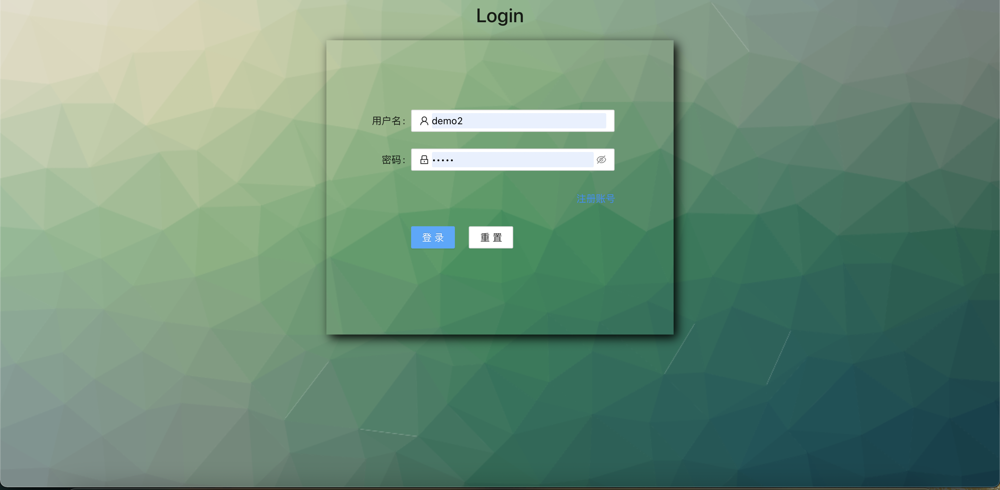
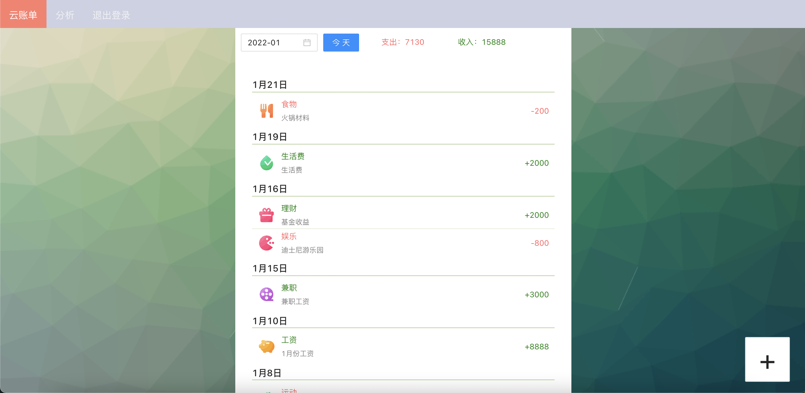
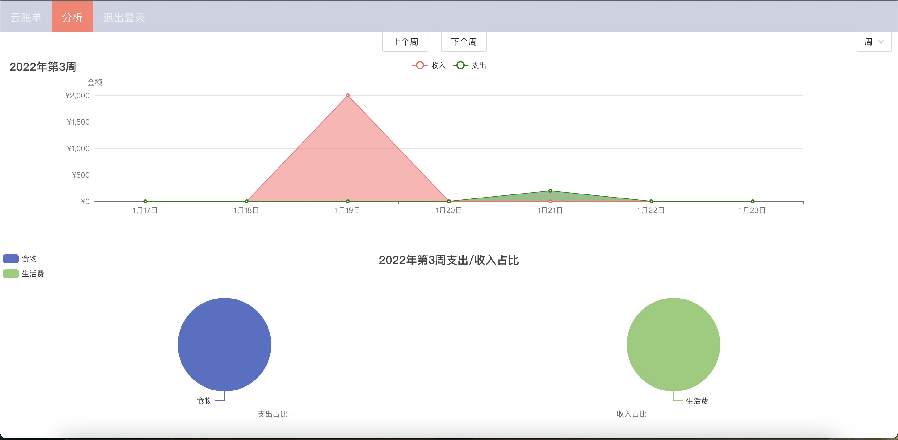

# CloudBill - 在线记账APP

## 使用

确保安装了`npm `或`yarn` 和`nodejs`环境

### 安装依赖

`yarn`

or

`npm install`

### 本地运行

`yarn start`

or

`npm run dev`

## 在线展示

https://cloudbill.web.cloudendpoint.cn/cloudBill

> 测试账号密码都是：demo2

## 参考：

https://ant.design/components/overview-cn/

https://reactrouter.com/docs/en/v6/getting-started/tutorial

https://echarts.apache.org/examples/zh/index.html

